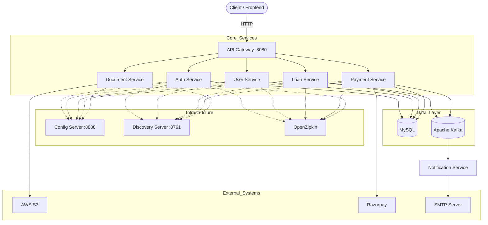
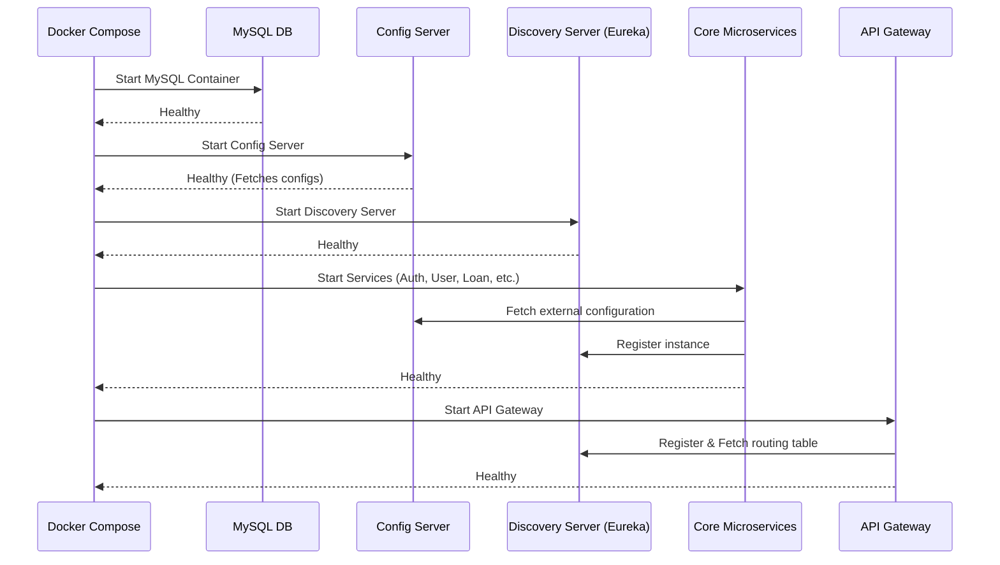
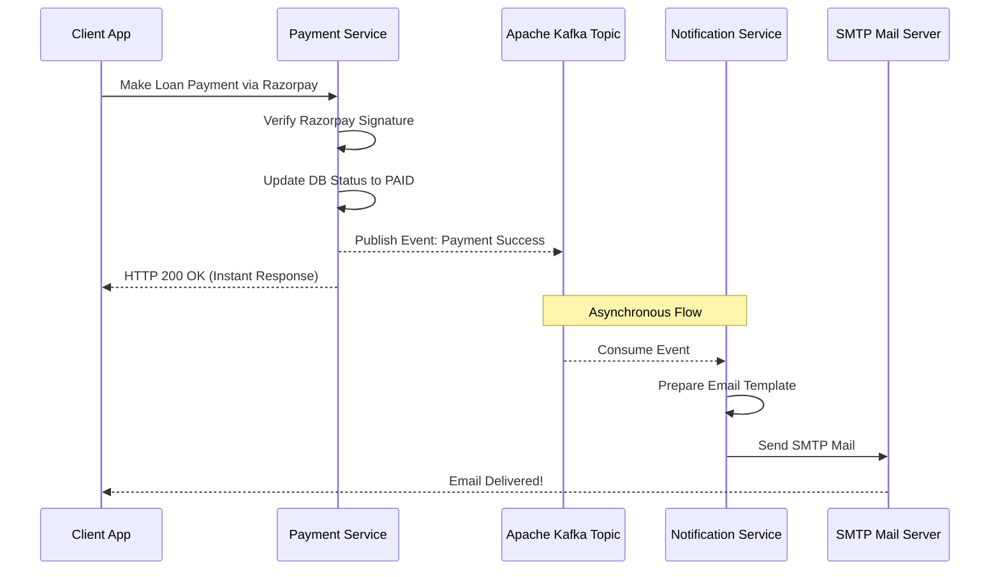

# PAYR – Enterprise-Grade Microservices Loan Management Platform

<div align="center">
  
  
  
  
  
  
</div>

## 📖 Executive Summary

PAYR is a cloud-native, enterprise-grade Loan Management System (LMS) designed using a distributed microservices architecture. It facilitates the complete lifecycle of loan processing—from onboarding and compliance to loan disbursement, repayment tracking, and notifications.

The system emphasizes:
- **Scalability** through independent service deployment
- **Resilience** via isolated service boundaries
- **Observability** with distributed tracing
- **Security** through centralized authentication and token-based access control
- **Event-driven communication** for high throughput and loose coupling

PAYR is production-ready and aligns with modern backend engineering best practices used in fintech systems.

---

## 🏛️ System Architecture Overview

The system follows a domain-driven microservices architecture, where each service encapsulates a specific business capability.
## 🏛️ System Architecture
---


### 🔑 Key Architectural Principles
- **Single Responsibility per Service**
- **Decentralized Data Management**
- **API-First Communication**
- **Event-Driven Workflows (Kafka)**
- **Centralized Configuration & Service Discovery**

---

## 🔧 Core Microservices & Responsibilities

### 1. API Gateway (`api-gateway`)
- **Role**: Unified entry point for all client interactions.
- **Responsibilities**:
  - Intelligent request routing to downstream services
  - Load balancing across service instances
  - Request filtering and validation
  - JWT token validation and authentication delegation
  - Rate limiting and edge security enforcement
- **Why it matters**: Eliminates direct exposure of internal services and enables centralized cross-cutting concerns.

### 2. Config Server (`config_server`)
- **Role**: Centralized configuration management system.
- **Responsibilities**:
  - Externalized configuration storage
  - Environment-based configuration resolution (dev, staging, prod)
  - Dynamic configuration updates without redeployment
  - Secure handling of sensitive properties via environment injection
- **Benefits**: Ensures consistency across services, removes configuration duplication, and enhances maintainability and security.

### 3. Discovery Server (`discovery_server`)
- **Role**: Service registry powered by Eureka.
- **Responsibilities**:
  - Dynamic service registration and deregistration
  - Service instance discovery for inter-service communication
  - Health monitoring of registered services
- **Advantages**: Eliminates hardcoded service endpoints and supports horizontal scaling seamlessly.

### 4. Authentication Service (`auth-service`)
- **Role**: Identity and access management provider.
- **Responsibilities**:
  - User authentication (login/signup workflows)
  - JWT token generation and validation
  - Role-based access control (RBAC)
  - Token lifecycle management (expiration, refresh)
- **Security Highlights**: Stateless authentication using JWT and integration with API Gateway for request validation.

### 5. User Service (`user_service`)
- **Role**: User domain management.
- **Responsibilities**:
  - User profile management
  - KYC (Know Your Customer) data handling
  - Validation of user identity information
  - Business rules related to user eligibility
- **Design Note**: Decoupled from authentication logic to maintain clean separation of concerns.

### 6. Document Service (`document_service`)
- **Role**: Secure document storage and retrieval.
- **Responsibilities**:
  - Uploading and managing user documents (ID proofs, financial records)
  - Integration with AWS S3 for scalable object storage
  - Metadata tracking for document lifecycle
  - Access control for sensitive documents
- **Why S3**: High durability and availability, cost-efficient storage for large files.

### 7. Loan Service (`loan_service`)
- **Role**: Core business engine of the system.
- **Responsibilities**:
  - Loan application processing
  - Interest calculation and amortization logic
  - Loan approval workflows
  - Status tracking (pending, approved, rejected, disbursed)
  - EMI schedule generation
- **Business Importance**: Encapsulates critical financial logic, designed for high reliability and accuracy.

### 8. Payment Service (`payment_service`)
- **Role**: Transaction and repayment processing.
- **Responsibilities**:
  - Integration with Razorpay payment gateway
  - Secure payment link generation
  - Handling payment callbacks/webhooks
  - Maintaining transaction states (success, failure, pending)
  - Reconciliation support
- **Security Considerations**: PCI-compliant interaction via Razorpay, idempotency handling for transaction retries.

### 9. Notification Service (`notification_service`)
- **Role**: Asynchronous communication system.
- **Responsibilities**:
  - Consumes Kafka events from various services
  - Sends email notifications (SMTP integration)
  - Handles events such as: Loan approval, Payment confirmation, Document upload success
- **Event-Driven Design**: Ensures non-blocking workflows and improves system responsiveness.

---

## ⚙️ Technology Stack Deep Dive

### Backend Frameworks
- **Java 21**: Virtual Threads for high concurrency, enhanced pattern matching
- **Spring Boot 3.2.5**: Rapid development with embedded server
- **Spring Cloud 2023.0.3**: Microservice orchestration patterns

### Infrastructure & Messaging
- **Docker & Docker Compose**: Containerized deployment, environment parity across dev/prod
- **Apache Kafka (KRaft Mode)**: Distributed event streaming, high-throughput asynchronous messaging
- **MySQL 8.4**: Reliable relational database, ACID-compliant transactions

### Cloud & Integrations
- **AWS S3**: Scalable object storage for documents
- **Razorpay**: Secure and reliable payment processing
- **SMTP Services**: Email delivery system

### Observability & Monitoring
- **OpenZipkin**: Distributed tracing across services, latency tracking and debugging, request flow visualization

---

## 🚀 Deployment & Execution

### Prerequisites
- Docker & Docker Compose installed
- Java 21 (optional for local builds)
- Valid credentials for: AWS S3, Razorpay, SMTP server

### Setup Instructions
```bash
# Clone repository
git clone <repository-url>

# Navigate to backend directory
cd payr_backend

# Configure environment variables
cp .env.example .env
# Fill in required credentials

# Build and start services
docker-compose up --build -d
```

### Startup Flow Sequence



### Access Point
- **API Gateway**: `http://localhost:8080`
- All external requests should be routed through this endpoint.

---

## 🔐 Security Architecture

### Authentication & Authorization
- JWT-based stateless authentication
- Token validation at API Gateway level
- Role-based access enforcement

### Secrets Management
- No hardcoded credentials
- Secure injection via `.env` and Config Server

### Best Practices Implemented
- Least privilege principle
- Secure API exposure
- Token expiration and validation

---

## 📡 Event-Driven Communication Flow



- A service publishes an event to Kafka.
- Notification Service consumes the event.
- Email or alert is triggered asynchronously.
- *Example: Payment Service → Kafka → Notification Service → Email Sent*

---

## 📈 Scalability & Resilience
- Horizontal scaling supported per service
- Fault isolation ensures system stability
- Kafka decouples service dependencies
- Retry and fallback strategies can be implemented easily

---

## 🤝 Contribution Guidelines
We welcome contributions to improve PAYR.

**Steps:**
1. Fork the repository
2. Create a feature branch
3. Commit changes with clear messages
4. Ensure tests pass
5. Submit a Pull Request

---

## 🧾 Conclusion

PAYR is a modern, scalable, and production-ready fintech backend system that demonstrates:
- Strong microservices design principles
- Real-world payment and storage integrations
- Event-driven architecture
- Enterprise-level observability and security

It serves as both a robust LMS solution and a reference architecture for building distributed systems in fintech.
